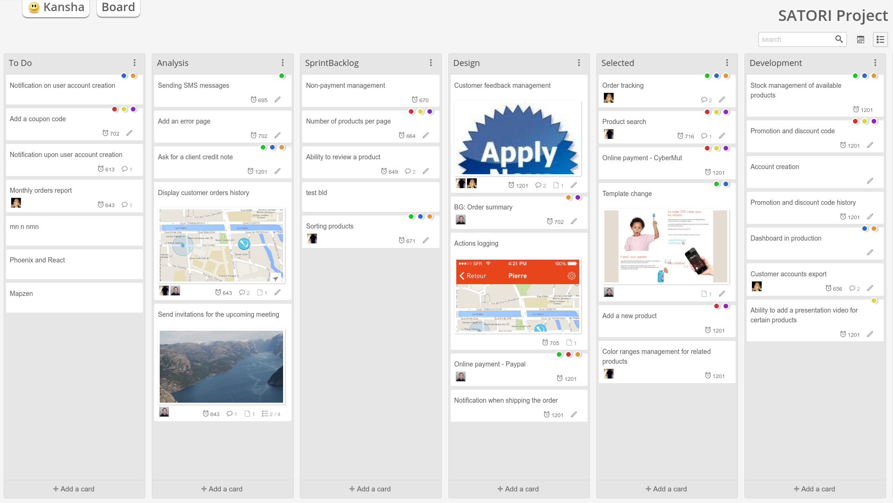

KANSHA
======

|docs|
|pypiv|
|travis|
|coverage|
|climate|

..
    |requires|

Kansha is an open source web application to manage and share collaborative scrum boards and `more <http://www.kansha.org>`_.

Kansha works with Firefox, Chrome, Internet Explorer 9 and above, Safari 7 and above.

Quickstart
----------

**Latest stable release is version 1.0.6**

`Try Kansha online <http://demo.kansha.org>`_ or install it on a computer:

* Run the latest stable release with Docker::

   docker run -p 8080:8080 netng/kansha:v1.0.6

* Install and run a stable release from Pypi: see the `installation documentation <http://kansha.readthedocs.org/en/stable/install.html>`_
* Or run from the latest source: see the `developper documentation <http://kansha.readthedocs.org/en/latest/devsetup.html>`_

Issues
------

If you have any problems with or questions about Kansha, please contact us through a `GitHub issue <https://github.com/Net-ng/kansha/issues>`_.

Contribute
----------

Join us!

* Github: https://github.com/Net-ng/kansha
* Bitbucket: https://bitbucket.org/net-ng/kansha
* Mailing list: http://groups.google.com/group/kansha-users

.. |docs| image:: https://readthedocs.org/projects/kansha/badge/?version=stable
    :alt: Documentation Status
    :scale: 100%
    :target: http://kansha.readthedocs.org

.. |climate| image:: https://codeclimate.com/github/Net-ng/kansha/badges/gpa.svg
   :target: https://codeclimate.com/github/Net-ng/kansha
   :alt: Code Climate

.. |travis| image:: https://travis-ci.org/Net-ng/kansha.svg
    :target: https://travis-ci.org/Net-ng/kansha

.. |coverage| image:: https://coveralls.io/repos/Net-ng/kansha/badge.svg?branch=master&service=github
  :target: https://coveralls.io/github/Net-ng/kansha?branch=master

.. |requires| image:: https://requires.io/github/Net-ng/kansha/requirements.svg?branch=master
     :target: https://requires.io/github/Net-ng/kansha/requirements/?branch=master
     :alt: Requirements Status

.. |pypiv| image:: https://img.shields.io/pypi/dw/kansha.svg
     :target: https://pypi.python.org/pypi/kansha/
     :alt: PyPI entry
