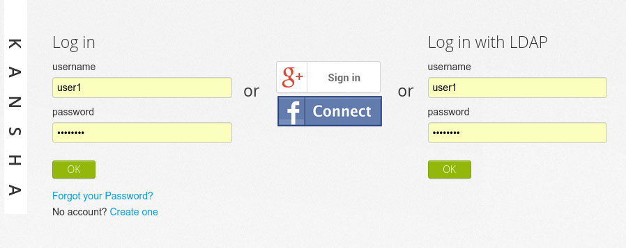
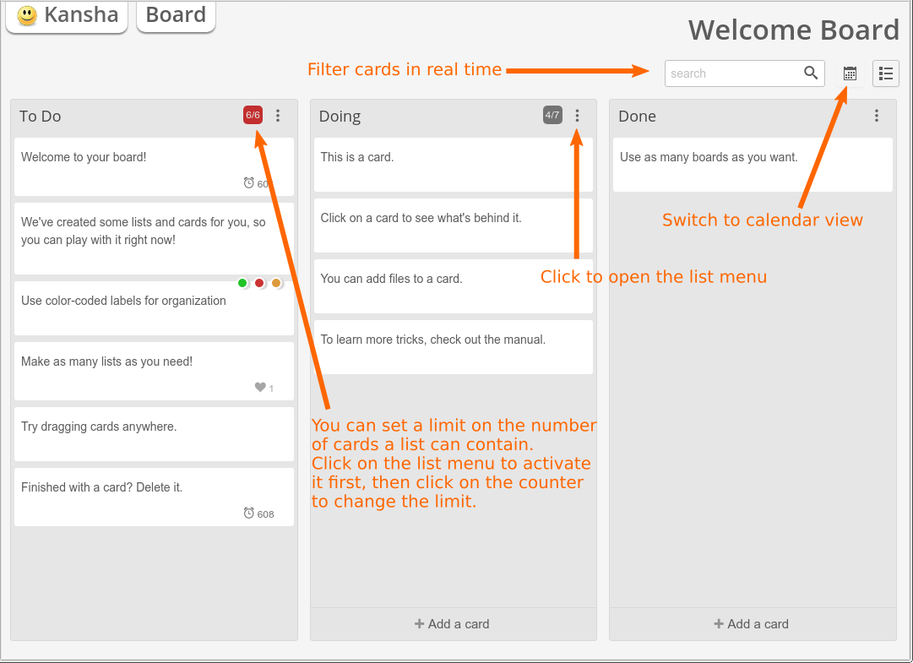

First connection
================

Kansha works with Firefox, Chrome, Internet Explorer 9 and above, Safari 7 and above.

Login screen
------------

   Login screen with all authentication methods enabled

Kansha supports three different authentication schemes:

* :ref:`dbauth`
* :ref:`ldapauth`
* :ref:`oauth` (Google, Facebook, Twitter…)

The administrator of Kansha may choose to enable one or several of those authentication methods. So, your actual login screen may differ from the one pictured above.

The installer created several demonstration accounts for you. They are: user1, user2, user3. They all have the same password: *password*.

.. _dbauth:

Database authentication
^^^^^^^^^^^^^^^^^^^^^^^

To be able to login with that form, you need to register an account first, by clicking on the *create one* link.

When you submit the registration form, an email is sent to you to verify your email address, or to a moderator who will verify your identity.
The actual registration process depends on the site policy.

If Kansha sends you an email, just follow the instructions. Basically, you have to click on a link to confirm your email address. Then your can login with your credentials.

If the registration is moderated, you may be contacted by the moderator. Eventually, the moderator will inform you when your account is activated or denied.

.. _ldapauth:

LDAP authentication
^^^^^^^^^^^^^^^^^^^

If LDAP authentication is enabled, you can login to Kansha with the credentials you already use to sign on the other applications of your company.

.. _oauth:

OAuth authentication
^^^^^^^^^^^^^^^^^^^^

OAuth authentication allows users of third party applications to log in Kansha.

The administrator of Kansha may grant access to users of:

* Google,
* Twitter,
* Facebook.

..
    * Github,
    * Dropbox,
    * Salesforce,
    * Flickr,
    * Vimeo,
    * Bitbucket,
    * Yahoo,
    * Dailymotion,
    * Viadeo,
    * Linkedin,
    * Foursquare,
    * or Instagram.

Welcome board
-------------

When you first login, you arrive straight on your *Welcome board*.

   Your very own welcome board.

In Kansha, a board is made of columns, also known as lists, that contain cards. You can add as many columns as you wish to a board.

Columns can be reordered by dragging and dropping them. Cards can be moved accross columns and reordered the same way.

To open a card, just click on it.

Take some time to play with the cards on your welcome board. Your welcome board is a sandbox where you can safely experiment without causing trouble to other users. It is loaded with cards which explain what you can do with them, in a kind of interactive tutorial.

On a card you can:

* edit the title;
* add/remove *labels* (tags);
* edit a description;
* comment;
* add and check check-lists;
* add files;
* vote (if activated by the board owner, see :ref:`board_configuration`);
* give it some weight (if activated by the board owner, see :ref:`board_configuration`);
* set a due date;
* assign members to it.

The columns may have a limit on the number of cards they accept. This limit is displayed after the slash in the column counter. To set the limit, just hover the mouse pointer on the right of the column counter: a menu activator icon will appear. Click on it to open the column's menu.

To change titles just click on them. That works for:

* cards;
* columns;
* board.

Now, look at the switches in the upper right corner of the screen. By default, *board mode* is activated. If you click on *calendar mode*, the screen displays a view of the current month where you can see the cards that expire that month.

Last, consider the main tabs. The **Kansha** one gives you access to your *home* (next section). The **Board** one contains everything you need to manage the current board.

Board operations available in the **Board** tab:

Preferences
    This menu allows you to configure the board and to subscribe to notifications. Board configuration is covered in :ref:`board_configuration`. Notifications will be sent to you by email.
Add list
    Add a new column.
Edit board description
    Describe here what the board is for.
Export board
    Export all cards as lines in an XLS file.
Action Log
    The *Action log* displays the history of the actions that happened on the current board. Open it and see what you have done in this board so far.
Delete board / Leave this board
    Respectively on boards you own and boards you are simply a member of, those actions just do what you would expect.

Home
----

On the home screen you have access to:

* the list of the boards you can participate in (see :ref:`board_access`);
* the list of all the cards you are assigned to (*My cards*);
* your profile, which you can edit.

On your profile, you can change the language of the interface. If your favorite language is missing, consider :ref:`contributing <contribute_trans>`.

You are encouraged to upload a picture of your face on your profile.

Searching
---------

Use the search input to search the cards.

Type your query terms here: the irrelevant cards are filtered out as you type and the matching cards are highlighted.

The search engine looks at the title, description, comments and labels of cards.